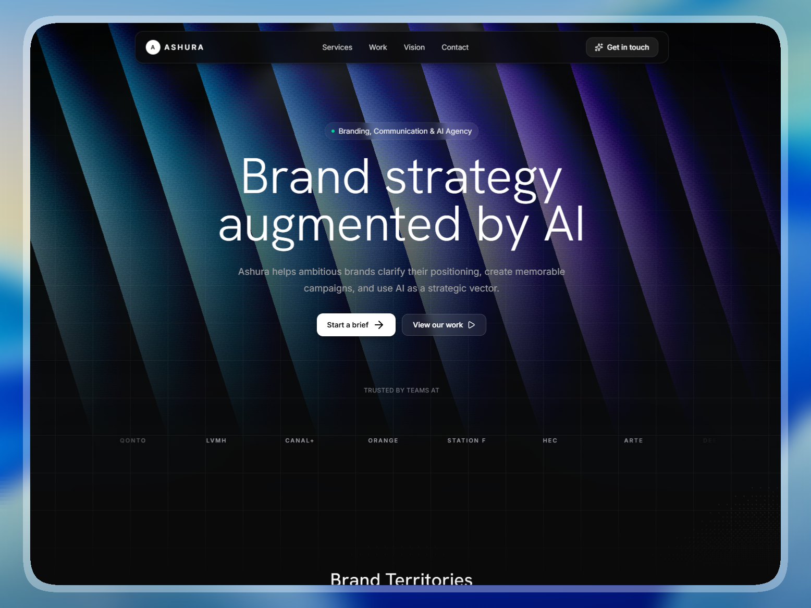

# ⚡ Ashura — Branding & AI Agency Landing Page

> **Day 13/30 of the "Building 1 AI-Generated Landing Page Every Day" Challenge**



## 🚀 About

Conceptual landing page for **Ashura**, a **branding and communication agency that uses AI as a strategic vector**, developed with **Next.js 16**, **TypeScript**, and **Tailwind CSS 4**. This project is the thirteenth realization of an ambitious challenge: creating **1 complete and functional mockup per day using AI**.

Ashura is presented through a high-end, image-led agency experience covering brand strategy, AI creative direction, campaign systems, and digital identity. The goal is to instantly convey **strategic clarity**, **creative authority**, **AI-augmented production**, and **brand impact** through a sleek, responsive, dark aesthetic.

Live URL: [https://ashura-landing.adrielzimbril.com](https://ashura-landing.adrielzimbril.com)

## 🎨 Design & Aesthetic Decisions

For this project, the theme focuses on **brand strategy, AI-assisted creative direction, campaign systems, and communication agency positioning**.

- **Modern Aesthetic:** The interface uses a dark, minimal agency language with card-based sections, grayscale imagery that reveals color on hover, and purposeful micro-interactions.
- **Performance First:** Every component is optimized for speed and efficiency, leveraging Next.js 16's latest features.
- **Responsive Design:** Fully responsive layout that adapts seamlessly across all device sizes.
- **Interactive Elements:** Smooth scrolling, floating navbar, inner-image scale hover (layout-stable), grayscale-to-color transitions, and bento-style section cards create a polished user experience.
- **Premium Identity:** Consistent typography with Hanken Grotesk, dark card surfaces, and a cohesive visual system keep the agency identity sharp throughout the entire experience.

## 🧩 Key Sections

- **🌟 Hero Section:** Agency positioning with headline, value proposition, CTA buttons, and a trusted-brands ticker.
- **⚡ Brand Territories:** Masonry gallery of visual systems and campaign work with grayscale-to-color hover reveal.
- **🎯 Agency Profile:** Split-layout card with the agency's strategic approach, skill tags, and phased methodology.
- **📊 Strategic Process:** Three-step method card — Diagnose, Design with AI, Deploy — with process step cards.
- **🏢 Services:** Four core service offerings with icon cards, tags, and a featured visual.
- **🌐 Modern Footer:** Comprehensive footer with links, contact routes, and agency information.

## 🛠️ Tech Stack

This mockup was built with cutting-edge technologies from the React ecosystem:

- **[Next.js 16](https://nextjs.org/)** with App Router and Turbopack
- **[React 19](https://react.dev/)**
- **TypeScript** for scalable component architecture and safer iteration.
- **[Tailwind CSS v4](https://tailwindcss.com/)** for design tokens, utilities, and modern CSS support.
- **[Motion/React](https://motion.dev/)** for scroll-triggered animations and entrance transitions.
- **Three.js & Postprocessing** for the ambient background visual layer.
- **[Lenis](https://lenis.darkroom.engineering/)** for smoother scroll behavior.
- **[Lucide React](https://lucide.dev/)** for clean, consistent iconography.
- **Next Font** with **Hanken Grotesk** and **Geist Mono** for optimized typography.

## 🚀 Quick Start

```bash
# Install dependencies
pnpm install

# Run development server
pnpm dev
```

Open [http://localhost:3000](http://localhost:3000) in your browser to see the result.

## 🌌 Let's meet in space (or on Earth) 🚀

I'm always happy to discuss new projects, collaborations, or simply exchange creative ideas. Here's how to contact me:

- **📧 Email**: [hello@adrielzimbril.com](mailto:hello@adrielzimbril.com)
- **🌐 Website**: [https://www.adrielzimbril.com](https://www.adrielzimbril.com)
- **🐦 Twitter**: [https://twitter.com/adrielzimbril](https://twitter.com/adrielzimbril)
- **💼 LinkedIn**: [https://www.linkedin.com/in/adrielzimbrilcode](https://www.linkedin.com/in/adrielzimbrilcode)
- **🐼 GitHub**: [https://github.com/adrielzimbril](https://github.com/adrielzimbril)

### 🐼 Fun Facts

- 🚀 Passionate about space exploration and technology
- 🐼 Love pandas (and animals in general!)
- 🎨 Creative at heart, whether in design or code
- ☕ Addicted to coffee and complex technical challenges

## 🌟 Join the Adventure

If you like this project, feel free to:

- ⭐ Star the project
- 🐞 Report bugs
- ✨ Suggest improvements
- 🚀 Share with other enthusiasts

## 💖 Support the Project

If you find this project useful and would like to support its development, you can do so through these platforms:

[](https://go.adrielzimbril.com/gs)

## 🌐 Hosting

This project is 100% hosted on modern cloud infrastructure for maximum performance and reliability:

[](https://vercel.com)

## 📄 License

This project is under the MIT license. Feel free to use it as a base for your own portfolio or project.

---

**Developed with ❤️ by Adriel Zimbril**
_Product Designer & Fullstack Developer_
🚀 Digital Universe Explorer | 🐼 Panda Friend | 🎨 Passionate Creator
